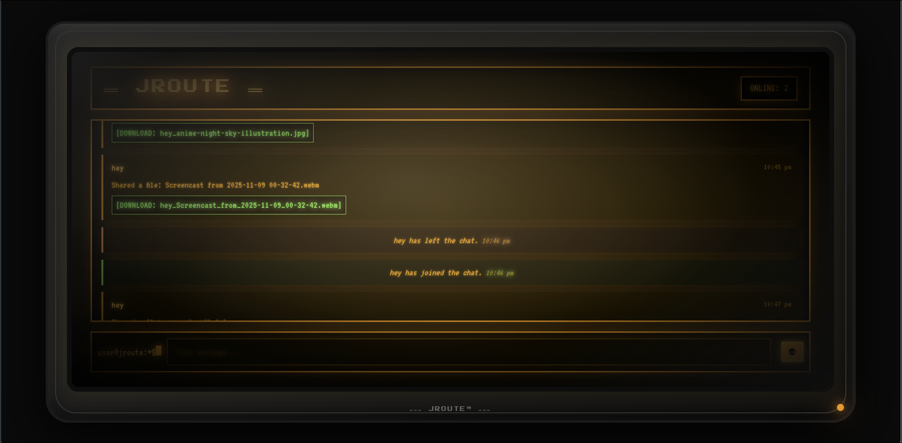
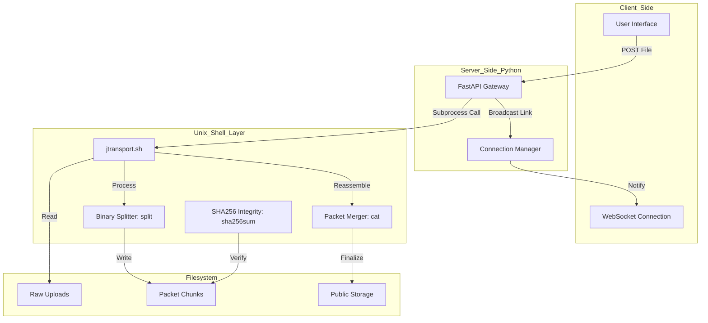

# JROUTE: The LAN Underground


> "Ever heard of the Silk Road? That was global. This is local."
>
> **JROUTE** brings the spirit of the decentralized web to your college lab. No internet? No problem.

-----

## Overview

**JROUTE** is a zero-dependency, **LAN-native** real-time communication and file transport system. Built for environments with restricted internet access, it turns a single workstation into a central communication hub for an entire local network.

This project is unique in its leveraging of the **Unix Operating System** to handle data physics. It features a custom **Hybrid Transport Protocol (J-Transport)** where Python orchestrates the network traffic, but **Bash** executes the heavy lifting for file manipulation, proving that the Shell is still a critical layer in modern application architecture.

-----
## Screenshots

The Jroute interface is designed with a **Cyberpunk Terminal UI** aesthetic, prioritizing readability and visual feedback for the **J-Transport Protocol** status.

| Jroute Terminal View 
| :------------------ |
|  

**Note:** For a single screenshot, use the first image tag below. For the best presentation, consider capturing two images and using the two separate tags/paths as structured above.

-----
## Key Features

* **Local-First Architecture:** Works entirely offline on a Local Area Network (WiFi/Ethernet).
* **Real-Time Relay:** WebSocket-based instant messaging with zero latency.
* **J-Transport Protocol:** A custom file transfer layer that uses **Unix System Calls** (`split`, `cat`, `sha256sum`) to ensure data integrity during packet transfer simulation.
* **Hybrid Backend:** Combines the ease of **FastAPI** (Python) for asynchronous network I/O with the power of **Bash** for command-line file processing.
* **Cyberpunk Terminal UI:** A "Diegetic" interface with scanlines, phosphor glow, and simulated terminal logs, providing visual feedback of the J-Transport process.
* **Anonymous:** No database, no accounts, session-based volatile identity.

-----

## The J-Transport Protocol

The **J-Transport Layer** avoids high-level language complexity by delegating core file operations to the operating system shell. This demonstrates effective **Inter-Process Communication (IPC)** between Python and Bash.

### How it works:

1.  **Ingestion:** FastAPI receives the raw binary stream from the client.
2.  **Handshake (IPC):** Python executes the `jtransport.sh` script as a subprocess.
3.  **Fragmentation:** Bash utilizes the **`split`** command to chop the file into 512KB binary packets.
4.  **Signing:** A **SHA-256** hash is generated for the original file, stored as an integrity signature.
5.  **Reassembly & Verification:** The receiver calls Bash to stitch the packets (**`cat`**) and then runs **`sha256sum`** again to verify the integrity against the signature.

### Architecture Flowchart




-----

## Project Structure

```text
jroute/
├── backend/
│   ├── jtransport.sh         # The Bash Protocol Brain (Splitting/Hashing, Executable)
│   ├── main.py               # FastAPI Controller, Upload Logic (Calls Bash)
│   ├── requirements.txt      # Python Dependencies (fastapi, uvicorn)
│   ├── shared_files/         # Final destination for reassembled files
│   ├── upload.log            # Server events log (Manual Check)
│   └── uploads/              # Temporary raw file ingestion zone
├── frontend/
│   ├── index.html            # The CRT Monitor UI Structure (HTML5)
│   ├── script.js             # Client Logic (WS, DOM & Bash Simulation Visuals)
│   └── styles.css            # CRT Effects (Custom CSS)
├── process_upload.sh         # Legacy/Deprecated script
└── run.sh                    # One-click environment bootstrapper
```

-----

## Installation & Usage

### Prerequisites

  * **OS:** Linux (Arch, Ubuntu, Debian) or macOS.
  * **Python:** 3.9+ installed with `venv`.
  * **Network:** Devices must be on the same local network.

### 1\. Setup Environment

```bash
# Navigate to the project directory
cd jroute

# Create Virtual Environment
python -m venv venv
source venv/bin/activate

# Install Dependencies
pip install -r backend/requirements.txt python-multipart
```

### 2\. Permission Grant

Ensure the J-Transport protocol script has execution rights:

```bash
chmod +x backend/jtransport.sh
```

### 3\. Launch the Grid

```bash
# Run the server on 0.0.0.0 to expose it to the LAN
uvicorn backend.main:app --host 0.0.0.0 --port 8000 --reload
```
